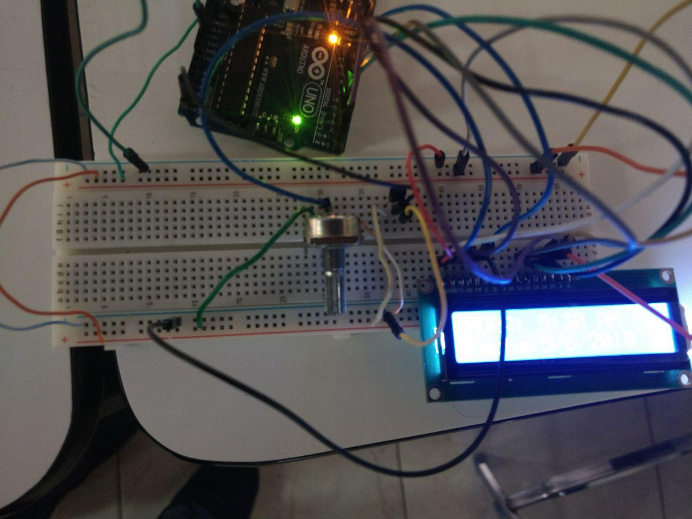

# Flask Kotlin Arduino Pantalla LCD

En este proyecto se demuestra la utilización de un WebService para la manipulación 
de un dispositivo arduino utilizando a Flask(Python) como web service, Android(Kotlin)
como interface de usuario entre el web service y el puerto serial del arduino.

# Componentes

 Pantalla LCD
 Dispositivo Arduino
 Dispositivo mobile con sistema Android
 Mac OSX como servidor

# Imagenes

